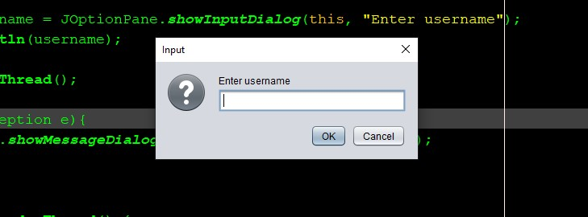
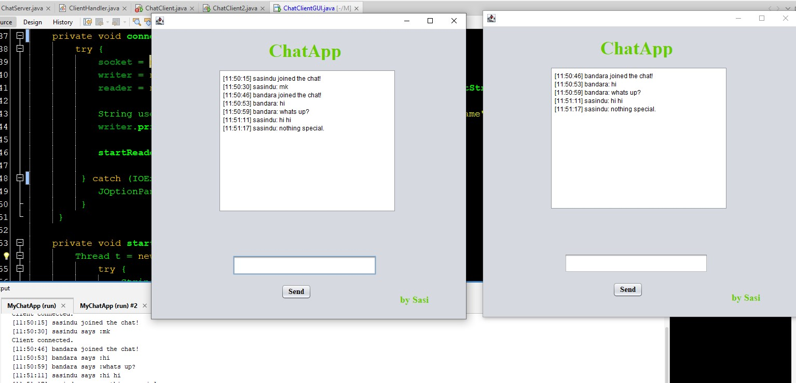

# JavaChatApp 🚀

A simple **Java Chat Application (Server + Client)** built with Java’s socket programming.  
This project is a *work in progress* — updated daily as I learn and improve real‑time networking in Java.

---

## 🧠 About

This repository contains a basic implementation of a chat application using `ServerSocket` and `Socket` in Java.  
It allows a client to connect to a server and send messages. My goal with this project is to gradually build it into a fully functional multi‑client chat system. :contentReference[oaicite:1]{index=1}

---

## 💡 Features (Work in Progress)

✔️ Server and client with basic message sending  
✔️ Plain text communication over sockets  
✔️ Multi‑client support   
✔️ GUI interface  
✔️ Message broadcast to all clients
 - Still updating...

Feel free to follow along or contribute! :contentReference[oaicite:2]{index=2}

---

## 📁 Project Structure

JavaChatApp
├── src

│ └── mychatapp

│ ├── ChatServer.java

│ └── ChatClient.java

  └── ChatClient2.java

├── build.xml

├── manifest.mf

└── README.md


---

## 🛠 Prerequisites

Make sure you have the following installed:

- ✔️ Java (JDK 8 or higher)  
- ✔ A Java IDE (IntelliJ, Eclipse, VS Code) or command‑line setup

---

## ▶️ How to Run

### Run the Server

1. Compile the server:
   ```bash
   javac ChatServer.java
Run it:

- java ChatServer
Run the Client
Compile the client:

- ChatClient.java
Run it:
java ChatClient
Now type messages in the client console to send them to the server.

---

## 📸 Application Screenshots

### 🖥️ Login Screen


### 💬 Chat Window


---

## 📈 Future Improvements
- ✔️ Add support for handling multiple clients
- ✔️ Add a GUI using Swing or JavaFX
- ✔️ Add message history support
- ✔️ Deploy as a runnable jar

## 🙌 Contributing
- This is a personal learning project — but contributions are welcome!
- If you have ideas or improvements, feel free to open an issue or pull request.

## 📬 Connect with Me
- If you want to follow my progress or see other projects:
- 👉 https://github.com/sasindusachintha

## 📄 License
This project is licensed under the MIT License – see the [LICENSE](LICENSE) file for details.

## ⭐ Thanks for checking out my JavaChatApp!
- Keep learning and keep coding 👨‍💻✨
